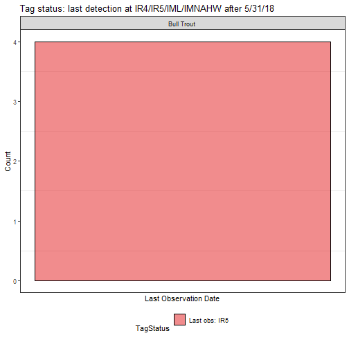
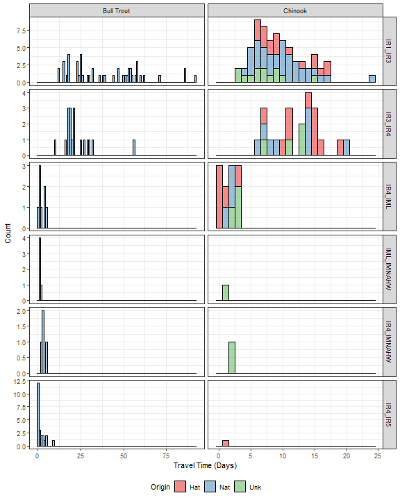

### Noteable Highlights/Data issues  

The purpose of this section is to provide a quick review of important events that occured during the 2019 trapping season.

* Imnaha Weir installation date: **xx June/July, 2019**.
* Within the Imnaha River basin, the Bull trout PIT tags used in the analyis were limited to detections after 1 March 2019.   
* Chinook PIT tag detections were constrained to 5/1/2019 - 10/1/2019.    


### Unique PIT-tag observations within the Imnaha Basin by species

-------------------------------------
 Mark.Species   Origin   Unique_Tags 
-------------- -------- -------------
  Bull Trout     Nat         133     

   Chinook       Hat          5      

   Chinook       Nat          5      
-------------------------------------

### Unique PIT-tag observations by species, origin and release site

---------------------------------------------------------
 Mark.Species   Origin   Release.Site.Code   Unique_Tags 
-------------- -------- ------------------- -------------
  Bull Trout     Nat          IMNAHW             21      

  Bull Trout     Nat          IMNTRP              9      

  Bull Trout     Nat          SNAKE3              6      

  Bull Trout     Nat          SNAKE4             97      

   Chinook       Hat          IMNAHR              2      

   Chinook       Hat          IMNAHW              2      

   Chinook       Hat          LGRLDR              1      

   Chinook       Nat          LGRLDR              5      
---------------------------------------------------------


### Unique PIT-tag observations by species, SiteID and origin
Unexpanded PIT tag counts at Big Sheep Creek (BSC), Cow Creek (COC), the mainstem PIT tag interrogation sites (IR1-IR5), the Imnaha adult ladder (IML), and the Imnaha facility trap house (IMNAHW).   

----------------------------------------------
 Mark.Species   SiteID   Origin   Unique_Tags 
-------------- -------- -------- -------------
  Bull Trout     IR1      Nat         91      

  Bull Trout     IR2      Nat         107     

  Bull Trout     BSC      Nat         11      

  Bull Trout     IR3      Nat         27      

  Bull Trout     IR5      Nat          2      

   Chinook       IR1      Hat          4      

   Chinook       IR1      Nat          5      

   Chinook       IR2      Hat          5      

   Chinook       IR2      Nat          5      

   Chinook       IR3      Nat          1      
----------------------------------------------


### Unique PIT-tag observations within the Imnaha Basin by species, origin and arrival date
First detection dates of unexpanded Bull Trout and Chinook salmon PIT tags at tributary (COC, BSC) and mainstem (IR1-IR5, IML, IMNAHW) PIT tag interrogation sites.  Site are organized from downstream to upstream with the most downstream interrogation site (COC) in the top two panels.   


### PIT tag detection efficiency at the node level  

Detection efficiencies at the node level (i.e., upstream and downstream antenna grous) and conversion rates for Bull Trout and Chinook Salmon detected at IR1-IR5, IML, and IMNAHW.  Detections in the trap house from the measuring board PIT reader will be labeled "IMNAHWB0".


```
## Error in nodeEfficiency(., direction = "Upstream"): could not find function "nodeEfficiency"
```

###PIT tag detection efficiency at the site level  

Detection efficiencies and converson rates at the site level.  See the Node level estimates above for an efficiency estimate at IR5B0.

```
## Error in nodeEfficiency(., direction = "Upstream"): could not find function "nodeEfficiency"
```


### Unique PIT-tag observations at the Imnaha Weir by trap status (based on observation date at weir sites (IR4, IML, IMNAHW, IR5)

-----------------------------------------------------
 Mark.Species    TrapStatus     SiteID   Unique_tags 
-------------- --------------- -------- -------------
  Bull Trout    Panels Closed    IR5          4      

  Bull Trout     Panels Open     IR5          1      
-----------------------------------------------------

### Passage routes of PIT-tagged fish successfully reaching and being detected at IR5 
This summary is limited to previously tagged fish (i.e., not tagged at IMNAHW in 2019) detected at IR5.  

*Passage Route descriptions:*  
* *Handled*: Processed in the trap house (IMNAHW) followed by a detection at IR5.  
* *IML obs = F *: Not detected at IML (F = False).  
* *IML obs = T*:  Detected at IML (T = True). 

*Trap Status descriptions*  
* *No obs at IR4*: no PIT tag observation at IR4.  
* *Panels Closed*: Indicates that the weir was fully operational.  
* *Panels Open*:  Separates out detections at IR5 before the weir was operational.  

 

------------------ ------------------ ---------------- -----------------
 **Mark.Species**   **PassageRoute**   **TrapStatus**   **Unique_tags** 

------------------ ------------------ ---------------- -----------------


### Unique PIT-tag observations by tag status  
*Tag status descriptions:*  
* *At Weir*: Observed at IR4 but not IML, IMNAHW, or IR5.   
* *Attempted Ladder*: Detected at IML, but not detected at IMNAHW.   
* *Last obs: BSC*: Observed at Big Sheep Creek.  
* *Last obs: IR1/IR2/IR3*: Observed at IR1, IR2, or IR3, respectively.  
* *NewTag*: Bull Trout tagged at IMNAHW in 2018.  
* *Passed*: Detected at IR5.  
* *Trapped*: Handled at IMNAHW, but no subsequent detection IR5.  
* *Trapped: Obs Below Weir*: Handled at IMNAHW & detected at IR4>IMNAHW  
 


--------------------------------------------------------
 Mark.Species   Origin      TagStatus       Unique_Tags 
-------------- -------- ------------------ -------------
  Bull Trout     Nat      Last obs: BSC         37      

  Bull Trout     Nat      Last obs: IR1         17      

  Bull Trout     Nat      Last obs: IR2         131     

  Bull Trout     Nat      Last obs: IR3         62      

  Bull Trout     Nat      Last obs: IR5          4      

  Bull Trout     Nat     Passed: <11 June        1      

   Chinook       Hat      Last obs: IR2          9      

   Chinook       Nat      Last obs: IR2          8      

   Chinook       Nat      Last obs: IR3          3      
--------------------------------------------------------




## Travel time between sites




### Tag Status = "Last Obs:  IR3" 

Summary of tags last observed at IR3. 


----------------------------
 Mark.Species   Origin   n  
-------------- -------- ----
  Bull Trout     Nat     62 

   Chinook       Nat     3  
----------------------------


### Tag Status = "At Weir" 

Fish assigned a tag status of "At Weir" have been detected at IR4 but have not been detected at IML, handled in the trap (IMNAHW), or detected at IR5. IR4_min and IR4_max are the first and last detection dates at IR4, respectively.


------------------ ------------ -------
 **Mark.Species**   **Origin**   **n** 

------------------ ------------ -------


----------- ------------------ ------------ ------------- -------------
 **TagID**   **Mark.Species**   **Origin**   **IR4_min**   **IR4_max** 

----------- ------------------ ------------ ------------- -------------

### Source Data
The complete PIT-tag histories for Chinook Salmon and Bull trout detected during 2019 in the Imnaha River Basin were downloaded as two seperate files located on the [PTAGIS ftp server](ftp://ftp.ptagis.org/MicroStrategyExport/). The files are the result of running "Complete Tag History" queries that were parameterized on the [PTAGIS website](https://www.ptagis.org/) and set-up to run and save automatically at 6:00 a.m. and 12:00 p.m. each day.  The first file contains Chinook Salmon PIT-tag detections and is stored at the "*feldhauj/2019_Imnaha_CompleteTagHistory.csv*" file path within the ftp server.  The second file contains Bull trout detections and is stored within the "*rkinzer/Imnaha_Bull_Complete_Tag_History.csv*" filepath.  We are then using an R-script to download the files from the PTAGIS ftp server and combine them into a single file.  Once the file is combined all Chinook Salmon and Bull trout tag detections are processed using the R package [PITcleanR](https://github.com/kevinsee/PITcleanR). The final dataset provides a simplified tag history with the first and last detection dates at each PIT-tag detection node (i.e., a single spanning array or antenna) and information regarding upstream and downstream movements and a more general migration direction.   

#####*Creating the PTAGIS Chinook Complete Tag History report:*  
* *Tag list #1:* All adult Chinook salmon detected at Lower Granite Dam.    
* *Event Date:* Between 5/1/2019 and 10/1/2019
* *Event Sites:* IR1, IR2, IR3, IR4, IR5, IML, IMNAHW, BSC, IMNAHR
* *Mark Species:* Chinook
* *Event Type:* Observation, Recapture, Recovery

#####*Creating the PTAGIS Bull Trout Complete Tag History report:*  
* *Query:* All PIT-tagged Bull trout detected in the Imnaha River Basin in 2018.   
* *Event Date:* Between 1/1/2018 and 10/1/2018
* *Event Sites:* IR1, IR2, IR3, IR4, IR5, IML, IMNAHW, COC, BSC, IMNAHR
* *Mark Species:* Bull Trout
* *Event Type:* Observation, Recapture, Recovery 


#####*Output Files:*  
* *PITcleanr_2019_chs_bull.xlsx*:  The complete tag histories from 2018_Imnaha_ComploeteTagHistory.csv and Imnanha_Bull_Complete_Tag_Histories.csv combined into a single file and processed with the PITcleanr R-package.  
* *detect_hist.xlsx*: A pivot table style summary. (This description is not complete JF 7/6/18) Each row = a unique PIT tag code.  Columns correspond to first detection dates at IR1-IR5, IML, and IMNAHW.  This file contains the Trap Status, TagPath, Passage Route, and TagStatus fields.  Trap status references the dates the weir was operating. TagPath is a character string representing detections at PIT tag observations sites.  TagStatus represents the last known location of the tag and whether the tag has arrived at the weir, has attempted the ladder (i.e., detected at IML), passed the weir (i.e., detected at IR5), or has been trapped (i.e., detected at IMNAHW). The tag pathway describes the passage route through the weir.
