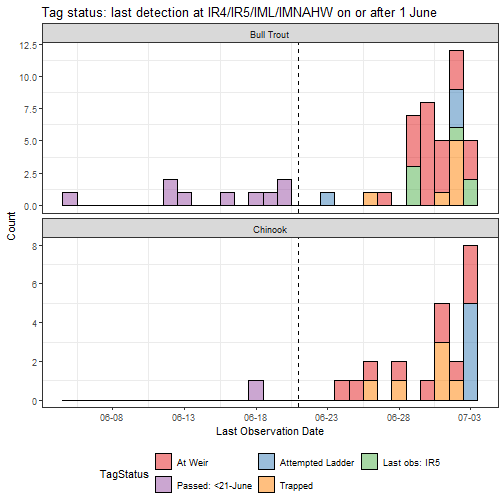

## Noteable Highlights/Data issues  

The purpose of this section is to provide a quick review of important events that occured during the 2019 trapping season.

  * Imnaha Weir installation date: **June 21, 2019**.  
  * PIT tag detections for Bull Trout and Chinook Salmon were limited to detection events that occured on or after 4/1/2019.   

## PIT summaries below the weir site
### Unique PIT-tag observations by species

-------------------------------------
 Mark.Species   Origin   Unique_Tags 
-------------- -------- -------------
  Bull Trout     Nat         152     

   Chinook       Hat         23      

   Chinook       Nat         48      

   Chinook       Unk         14      
-------------------------------------

### Unique PIT-tag observations by species, origin and release site

---------------------------------------------------------
 Mark.Species   Origin   Release.Site.Code   Unique_Tags 
-------------- -------- ------------------- -------------
  Bull Trout     Nat          IMNAHW             27      

  Bull Trout     Nat          IMNTRP             12      

  Bull Trout     Nat          SNAKE3             10      

  Bull Trout     Nat          SNAKE4             103     

   Chinook       Hat          IMNAHR              9      

   Chinook       Hat          IMNAHW             11      

   Chinook       Hat          LGRLDR              3      

   Chinook       Nat          IMNAHR              2      

   Chinook       Nat          IMNTRP              8      

   Chinook       Nat          LGRLDR             38      

   Chinook       Unk          BONAFF             14      
---------------------------------------------------------

### Unique PIT-tag observations by species, SiteID and origin
Unexpanded PIT tag counts at Big Sheep Creek (BSC), and the mainstem PIT tag interrogation sites (IR1-IR5), the Imnaha adult ladder (IML), and the Imnaha facility trap house (IMNAHW).   

----------------------------------------------
 Mark.Species   SiteID   Origin   Unique_Tags 
-------------- -------- -------- -------------
  Bull Trout     BSC      Nat         13      

  Bull Trout     IML      Nat          9      

  Bull Trout    IMNAHW    Nat          7      

  Bull Trout     IR1      Nat         53      

  Bull Trout     IR2      Nat         66      

  Bull Trout     IR3      Nat         93      

  Bull Trout     IR4      Nat         32      

  Bull Trout     IR5      Nat         40      

   Chinook       BSC      Nat          1      

   Chinook       IML      Hat          5      

   Chinook       IML      Nat          3      

   Chinook       IML      Unk          3      

   Chinook      IMNAHW    Unk          1      

   Chinook       IR1      Hat         21      

   Chinook       IR1      Nat         48      

   Chinook       IR1      Unk         14      

   Chinook       IR2      Hat         20      

   Chinook       IR2      Nat         46      

   Chinook       IR2      Unk         11      

   Chinook       IR3      Hat         18      

   Chinook       IR3      Nat         37      

   Chinook       IR3      Unk         13      

   Chinook       IR4      Hat         10      

   Chinook       IR4      Nat          8      

   Chinook       IR4      Unk          4      

   Chinook       IR5      Hat          1      

   Chinook       IR5      Nat          1      
----------------------------------------------

### Unique PIT-tag observations within the Imnaha Basin by species, origin and arrival date
First detection dates of unexpanded Bull Trout and Chinook salmon PIT tags at tributary (COC, BSC) and mainstem (IR1-IR5, IML, IMNAHW) PIT tag interrogation sites.  Site are organized from downstream to upstream with the most downstream interrogation site (COC) in the top two panels.   

## PIT tag detection efficiency calculations
### Efficiency at the node level  

Detection efficiencies at the node level (i.e., upstream and downstream antenna grous) and conversion rates for Bull Trout and Chinook Salmon detected at IR1-IR5, IML, and IMNAHW.  Detections in the trap house from the measuring board PIT reader will be labeled "IMNAHWB0".

----------------------------------------------------------------------------
 Mark.Species     Node     tagsAtNode   estTagsAtNode   detEff   Conversion 
-------------- ---------- ------------ --------------- -------- ------------
  Bull Trout      IR1          53            167         0.32       NA%     

  Bull Trout      IR2          66            172         0.38       103%    

  Bull Trout     IR3B0         57            168         0.34       98%     

  Bull Trout     IR3A0         59            155         0.38       92%     

  Bull Trout     IR4B0         22            50          0.44       32%     

  Bull Trout     IR4A0         30            51          0.59       102%    

  Bull Trout     IMLB0         9             43          0.21       84%     

  Bull Trout     IMLA0         8             43          0.19       100%    

  Bull Trout    IMNAHWB0       5             41          0.12       95%     

  Bull Trout    IMNAHWA0       7             41          0.17       100%    

  Bull Trout     IR5B0         33            41          0.8        100%    

  Bull Trout     IR5A0         36            41          0.88       100%    

   Chinook        IR1          83            85          0.98       NA%     

   Chinook        IR2          77            83          0.93       98%     

   Chinook       IR3B0         66            69          0.96       83%     

   Chinook       IR3A0         33            69          0.48       100%    

   Chinook       IR4B0         21            23          0.91       33%     

   Chinook       IR4A0         21            23          0.91       100%    

   Chinook       IMLB0         11            12          0.92       52%     

   Chinook       IMLA0         11            12          0.92       100%    

   Chinook      IMNAHWB0       6              8          0.75       67%     

   Chinook      IMNAHWA0       1              7          0.14       88%     

   Chinook       IR5B0         2              2           1         29%     

   Chinook       IR5A0         2              2           1         100%    
----------------------------------------------------------------------------

### Efficiency at the site level  

Detection efficiencies and converson rates at the site level.  See the Node level estimates above for an efficiency estimate at IR5B0.

--------------------------------------------------------------------------
 Mark.Species   SiteID   tagsAtSite   estTagsAtSite   detEff   Conversion 
-------------- -------- ------------ --------------- -------- ------------
  Bull Trout     IR1         53            167         0.32       NA%     

  Bull Trout     IR2         66            172         0.38       103%    

  Bull Trout     IR3         93            183         0.51       106%    

  Bull Trout     IR4         32            55          0.58       30%     

  Bull Trout     IML         9             52          0.17       95%     

  Bull Trout    IMNAHW       7             46          0.15       88%     

  Bull Trout     IR5         40            40           1         87%     

   Chinook       IR1         83            85          0.98       NA%     

   Chinook       IR2         77            83          0.93       98%     

   Chinook       IR3         68            68           1         82%     

   Chinook       IR4         22            24          0.92       35%     

   Chinook       IML         11            13          0.85       54%     

   Chinook      IMNAHW       6             10          0.6        77%     

   Chinook       IR5         2              2           1         20%     
--------------------------------------------------------------------------

## Summaries focusd on the Weir   
### Unique PIT-tag observations at the Imnaha Weir by trap status (based on observation date at weir sites (IR4, IML, IMNAHW, IR5)

-----------------------------------------------------
 Mark.Species    TrapStatus     SiteID   Unique_tags 
-------------- --------------- -------- -------------
  Bull Trout    Panels Closed    IML          9      

  Bull Trout    Panels Closed   IMNAHW        7      

  Bull Trout    Panels Closed    IR4         31      

  Bull Trout    Panels Closed    IR5         30      

  Bull Trout     Panels Open     IR4          1      

  Bull Trout     Panels Open     IR5         10      

   Chinook      Panels Closed    IML         11      

   Chinook      Panels Closed   IMNAHW        1      

   Chinook      Panels Closed    IR4         22      

   Chinook      Panels Closed    IR5          1      

   Chinook       Panels Open     IR5          1      
-----------------------------------------------------

### Passage routes of PIT-tagged fish successfully reaching and being detected at IR5 
This summary is limited to previously tagged fish (i.e., not tagged at IMNAHW in 2019) detected at IR5.  

*Passage Route descriptions:*  
* *Handled*: Processed in the trap house (IMNAHW) followed by a detection at IR5.  
* *IML obs = F *: Not detected at IML (F = False).  
* *IML obs = T*:  Detected at IML (T = True). 

*Trap Status descriptions*  
* *No obs at IR4*: no PIT tag observation at IR4.  
* *Panels Closed*: Indicates that the weir was fully operational.  
* *Panels Open*:  Separates out detections at IR5 before the weir was operational.  

 

------------------ ------------------ ---------------- -----------------
 **Mark.Species**   **PassageRoute**   **TrapStatus**   **Unique_tags** 

------------------ ------------------ ---------------- -----------------

### Unique PIT-tag observations by tag status  
*Tag status descriptions:*  
* *At Weir*: Observed at IR4 but not IML, IMNAHW, or IR5.   
* *Attempted Ladder*: Detected at IML, but not detected at IMNAHW.   
* *Last obs: BSC*: Observed at Big Sheep Creek.  
* *Last obs: IR1/IR2/IR3*: Observed at IR1, IR2, or IR3, respectively.  
* *NewTag*: Bull Trout tagged at IMNAHW in 2019.  
* *Passed*: Detected at IR5.  
* *Trapped*: Handled at IMNAHW, but no subsequent detection IR5.  
* *Trapped: Obs Below Weir*: Handled at IMNAHW & detected at IR4>IMNAHW  
 

--------------------------------------------------------
 Mark.Species   Origin      TagStatus       Unique_Tags 
-------------- -------- ------------------ -------------
  Bull Trout     Nat         At Weir            23      

  Bull Trout     Nat     Attempted Ladder        4      

  Bull Trout     Nat      Last obs: BSC          5      

  Bull Trout     Nat      Last obs: IR1          7      

  Bull Trout     Nat      Last obs: IR2         17      

  Bull Trout     Nat      Last obs: IR3         68      

  Bull Trout     Nat      Last obs: IR5          6      

  Bull Trout     Nat     Passed: <21-June       10      

  Bull Trout     Nat         Trapped             7      

   Chinook       Hat         At Weir             5      

   Chinook       Hat     Attempted Ladder        1      

   Chinook       Hat      Last obs: IR1          2      

   Chinook       Hat      Last obs: IR2          3      

   Chinook       Hat      Last obs: IR3          8      

   Chinook       Hat         Trapped             4      

   Chinook       Nat         At Weir             5      

   Chinook       Nat     Attempted Ladder        2      

   Chinook       Nat      Last obs: IR2         11      

   Chinook       Nat      Last obs: IR3         28      

   Chinook       Nat     Passed: <21-June        1      

   Chinook       Nat         Trapped             1      

   Chinook       Unk         At Weir             1      

   Chinook       Unk     Attempted Ladder        2      

   Chinook       Unk      Last obs: IR1          1      

   Chinook       Unk      Last obs: IR3          9      

   Chinook       Unk         Trapped             1      
--------------------------------------------------------

## Travel time between sites

### Tag Status = "Last Obs:  IR3" 

Summary of tags last observed at IR3. Some of these tags will "drop-out" before reaching the weir site (IR4/IML/IR5).

----------------------------
 Mark.Species   Origin   n  
-------------- -------- ----
  Bull Trout     Nat     68 

   Chinook       Hat     8  

   Chinook       Nat     28 

   Chinook       Unk     9  
----------------------------

### Tag Status = "At Weir" 

Fish assigned a tag status of "At Weir" have been detected at IR4 but have not been detected at IML, handled in the trap (IMNAHW), or detected at IR5. IR4_min and IR4_max are the first and last detection dates at IR4, respectively.

--------------------------
  Species     Origin   n  
------------ -------- ----
 Bull Trout    Nat     23 

  Chinook      Hat     5  

  Chinook      Nat     5  

  Chinook      Unk     1  
--------------------------

-------------------------------------------------------------------------------
     TagID         Species     Release.Site   Origin    IR4_min      IR4_max   
---------------- ------------ -------------- -------- ------------ ------------
 3DD.007771FE7F   Bull Trout      IMNAHW       Nat     2019-06-27   2019-06-28 

 3DD.007775A00D   Bull Trout      IMNAHW       Nat     2019-06-28   2019-06-29 

 3DD.0077723173   Bull Trout      SNAKE4       Nat     2019-06-29   2019-06-29 

 3DD.0077943328   Bull Trout      SNAKE4       Nat     2019-06-29   2019-06-29 

 3D9.1C2DE27C79   Bull Trout      SNAKE4       Nat     2019-06-25   2019-06-29 

 3DD.007771E167   Bull Trout      IMNAHW       Nat     2019-06-29   2019-06-29 

 3DD.0077724360   Bull Trout      IMNAHW       Nat     2019-06-30   2019-06-30 

 3DD.0077750322   Bull Trout      IMNTRP       Nat     2019-06-30   2019-06-30 

 3DD.007772BBC9   Bull Trout      IMNAHW       Nat     2019-06-30   2019-06-30 

 3DD.0077725D55   Bull Trout      SNAKE4       Nat     2019-06-30   2019-06-30 

 3DD.007775B9FA   Bull Trout      IMNAHW       Nat     2019-06-27   2019-06-30 

 3DD.0077809241   Bull Trout      SNAKE4       Nat     2019-07-01   2019-07-01 

 3DD.00777219D6   Bull Trout      IMNAHW       Nat     2019-06-30   2019-07-01 

 3DD.0077752161   Bull Trout      IMNAHW       Nat     2019-07-01   2019-07-01 

 3DD.0077918E85   Bull Trout      SNAKE4       Nat     2019-07-01   2019-07-01 

 3DD.00777290B1   Bull Trout      SNAKE4       Nat     2019-07-01   2019-07-02 

 3D9.1C2DE138D6   Bull Trout      SNAKE4       Nat     2019-07-02   2019-07-02 

 3DD.0077756E93   Bull Trout      SNAKE4       Nat     2019-07-02   2019-07-02 

 3DD.0077754E26   Bull Trout      SNAKE4       Nat     2019-07-01   2019-07-03 

 3DD.0077759BB5   Bull Trout      IMNAHW       Nat     2019-07-03   2019-07-03 

 3DD.007771E48E   Bull Trout      IMNAHW       Nat     2019-06-30   2019-07-03 

 3DD.007795311B   Bull Trout      SNAKE4       Nat     2019-07-03   2019-07-03 

 3DD.007772C6B1   Bull Trout      SNAKE4       Nat     2019-06-29   2019-07-03 

 3DD.00775E5489    Chinook        LGRLDR       Nat     2019-06-25   2019-06-26 

 3DD.0077948EBE    Chinook        IMNAHR       Hat     2019-06-27   2019-06-30 

 3DD.00775F62EE    Chinook        LGRLDR       Hat     2019-06-26   2019-07-01 

 3DD.00775F41A3    Chinook        LGRLDR       Nat     2019-07-01   2019-07-01 

 3DD.007776D0E1    Chinook        IMNTRP       Nat     2019-06-30   2019-07-02 

 3DD.00775F90B3    Chinook        LGRLDR       Nat     2019-06-23   2019-07-03 

 3DD.00775F2D70    Chinook        LGRLDR       Nat     2019-07-03   2019-07-03 

 3DD.007793E2C1    Chinook        IMNAHW       Hat     2019-07-03   2019-07-03 

 3DD.00779385F0    Chinook        IMNAHW       Hat     2019-07-03   2019-07-03 

 3DD.007793748A    Chinook        IMNAHW       Hat     2019-07-01   2019-07-03 

 3DD.0077C15DC2    Chinook        BONAFF       Unk     2019-07-01   2019-07-03 
-------------------------------------------------------------------------------

### Source Data
The complete PIT-tag histories for Chinook Salmon and Bull trout detected during 2019 in the Imnaha River Basin were downloaded as two seperate files located on the [PTAGIS ftp server](ftp://ftp.ptagis.org/MicroStrategyExport/). The files are the result of running "Complete Tag History" queries that were parameterized on the [PTAGIS website](https://www.ptagis.org/) and set-up to run and save automatically at 6:00 a.m. and 12:00 p.m. each day.  The first file contains Chinook Salmon PIT-tag detections and is stored at the file path "*feldhauj/2019_Imnaha_CompleteTagHistory.csv*" within the ftp server.  The second file contains Bull trout detections and is stored within the "*rkinzer/Imnaha_Bull_Complete_Tag_History.csv*" filepath.  We are then using an R-script to download the files from the PTAGIS ftp server and combine them into a single file.  Once the file is combined all Chinook Salmon and Bull trout tag detections are processed using the R package [PITcleanR](https://github.com/kevinsee/PITcleanR). The final dataset provides a simplified tag history with the first and last detection dates at each PIT-tag detection node (i.e., a single spanning array or antenna) and information regarding upstream and downstream movements and a more general migration direction. 

### *Creating the PTAGIS Chinook Complete Tag History report:*  
* *Tag list #1:* All adult Chinook salmon detected at Lower Granite Dam.    
* *Event Date:* Between 5/1/2019 and 10/1/2019
* *Event Sites:* IR1, IR2, IR3, IR4, IR5, IML, IMNAHW, BSC, IMNAHR
* *Mark Species:* Chinook
* *Event Type:* Observation, Recapture, Recovery

### *Creating the PTAGIS Bull Trout Complete Tag History report:*  
* *Query:* All PIT-tagged Bull trout detected in the Imnaha River Basin.   
* *Event Date:* Between 1/1/2019 and 12/31/2019. For this report, limited to dates after 31 March.
* *Event Sites:* IR1, IR2, IR3, IR4, IR5, IML, IMNAHW, BSC, IMNAHR
* *Mark Species:* Bull Trout
* *Event Type:* Observation, Recapture, Recovery 

### *Output Files:*  
Some very brief meta data descriptions for two output files processed with R scripts.  For more details on these files, contact Joseph Feldhaus (Joseph.Feldhaus@state.or.us) or Ryan Kinzer (ryank@nezperce.org).

  * *PITcleanr_2019_chs_bull.xlsx*:  The complete tag histories from 2018_Imnaha_ComploeteTagHistory.csv and Imnanha_Bull_Complete_Tag_Histories.csv combined into a single file and processed with the PITcleanr R-package.  

  * *detect_hist.xlsx*: A pivot table style summary. (This description is not complete JF 7/6/18) Each row = a unique PIT tag code.  Columns correspond to first detection dates at IR1-IR5, IML, and IMNAHW.  This file contains the Trap Status, TagPath, Passage Route, and TagStatus fields.  Trap status references the dates the weir was operating. TagPath is a character string representing detections at PIT tag observations sites.  TagStatus represents the last known location of the tag and whether the tag has arrived at the weir, has attempted the ladder (i.e., detected at IML), passed the weir (i.e., detected at IR5), or has been trapped (i.e., detected at IMNAHW). The tag pathway describes the passage route through the weir.
